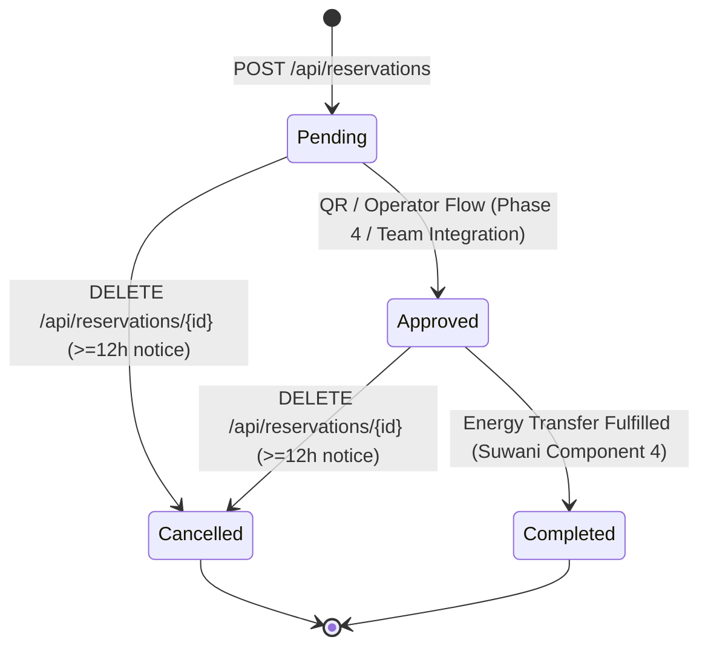

# Component 2: Energy Reservation & Slot Management — Authoritative API Contract

**Document Version:** 2.0 (Phase 2 Frozen Baseline)  
**Target Branch:** `feature/viman-reservation-slots`  
**API Framework:** ASP.NET Core 8.0 / C#  
**Database:** MongoDB (`MongoDbContext`)  
**Serialization:** `System.Text.Json` (Default `CamelCase` property naming)  

---

## 1. Overview & Architecture Boundary

Component 2 provides backend services for managing **Energy Booking Slots** and **Energy Reservations**. This document serves as the frozen, authoritative API specification for all consumers:
- **Component 1 (Thumashi):** Prosumer / User Identity & Authentication.
- **Component 2 (Viman):** Slot Creation, Scheduling, Reservation Lifecycle & Availability Engine.
- **Component 3 (Nethasa):** Microgrid Node Management, Operator & Prosumer Dashboards, Booking Views.
- **Component 4 (Suwani):** QR Scanning, Operator Check-In & Energy Transfer Verification.

### Authoritative Architecture Principles
1. **Server Authority:** The API backend is the sole authority for slot availability, capacity protection, booking window limits, notice intervals, and lifecycle state transitions. Clients must NEVER calculate, override, or manage availability independently.
2. **Immutable Capacity:** Slot `capacity` is established upon slot creation and remains strictly immutable thereafter to prevent scheduling corruption.
3. **Availability Invariant:** The database invariant `0 <= Availability <= Capacity` is enforced across all operations (create, update, cancel).
4. **No Direct Web/Android Work in Phase 2:** All API contracts documented herein reflect the verified, tested, and running backend implementation.

---

## 2. API Base URLs & Environment Configuration

| Environment | Protocol | Base URL | Notes |
| :--- | :--- | :--- | :--- |
| **Local HTTPS (Kestrel)** | `https` | `https://localhost:7193` | Default local development endpoint |
| **Local HTTP (Kestrel)** | `http` | `http://localhost:5148` | Fallback local HTTP endpoint |
| **IIS Express** | `http` | `http://localhost:40456` | Visual Studio standard launch profile |
| **Shared Team Tunnel** | `https` | `<ngrok-assigned-url>.ngrok-free.app` | Requires header `ngrok-skip-browser-warning: true` |

*Swagger UI is enabled in development mode at `/swagger/index.html`.*

---

## 3. Authoritative Data Models & Casing

All endpoints accept and return JSON using standard **camelCase** property naming.

### 3.1 EnergyBookingSlot Schema (`api/MicrogridApi/Models/EnergyBookingSlot.cs`)

| Property | JSON Field | Data Type | Mandatory / Generated | Description |
| :--- | :--- | :--- | :--- | :--- |
| `Id` | `id` | `string` | Generated (Server) | 24-character hex MongoDB ObjectId |
| `SlotId` | `slotId` | `string` | Generated (Server) | Unique business key formatted as `SLOT-XXXXXXXX` (e.g., `SLOT-A1B2C3D4`) |
| `StationId` | `stationId` | `string` | Required (Client) | Node identifier referencing `MicrogridNode.NodeId` (e.g., `ST-001`) |
| `Date` | `date` | `string` | Required (Client) | Calendar date in ISO 8601 UTC format (`YYYY-MM-DDTHH:mm:ssZ`) |
| `StartTime` | `startTime` | `string` | Required (Client) | 24-hour time string in `HH:mm` format (e.g., `"09:00"`) |
| `EndTime` | `endTime` | `string` | Required (Client) | 24-hour time string in `HH:mm` format (e.g., `"11:00"`). Must be after `startTime` |
| `Capacity` | `capacity` | `integer` | Required (Client) | Maximum concurrent bookings permitted (`capacity > 0`). Immutable after creation |
| `Availability` | `availability` | `integer` | Generated (Server) | Remaining open spaces (`0 <= availability <= capacity`). Initialized to `capacity` |
| `Status` | `status` | `string` | Server / Client | Slot operational status: `"Available"` or `"Unavailable"`. Default is `"Available"` |
| `CreatedAt` | `createdAt` | `string` | Generated (Server) | UTC creation timestamp (ISO 8601) |
| `UpdatedAt` | `updatedAt` | `string` | Generated (Server) | UTC last modification timestamp (ISO 8601) |

#### Full Slot JSON Example
```json
{
  "id": "673cf02b9e11894d8091ab10",
  "slotId": "SLOT-5F4E3D2C",
  "stationId": "ST-001",
  "date": "2026-09-25T00:00:00Z",
  "startTime": "09:00",
  "endTime": "11:00",
  "capacity": 5,
  "availability": 5,
  "status": "Available",
  "createdAt": "2026-09-23T10:15:30Z",
  "updatedAt": "2026-09-23T10:15:30Z"
}
```

---

### 3.2 EnergyReservation Schema (`api/MicrogridApi/Models/EnergyReservation.cs`)

| Property | JSON Field | Data Type | Mandatory / Generated | Description |
| :--- | :--- | :--- | :--- | :--- |
| `Id` | `id` | `string` | Generated (Server) | 24-character hex MongoDB ObjectId |
| `ReservationId` | `reservationId` | `string` | Generated (Server) | Unique business key formatted as `RES-XXXXXXXX` (e.g., `RES-D9C8B7A6`) |
| `ProsumerNic` | `prosumerNic` | `string` | Required (Client) | National Identity Card of prosumer referencing `Prosumer.Nic` |
| `StationId` | `stationId` | `string` | Required (Client) | Node identifier referencing `MicrogridNode.NodeId` (matches slot station) |
| `SlotId` | `slotId` | `string` | Required (Client) | Booking slot key referencing `EnergyBookingSlot.SlotId` |
| `Status` | `status` | `string` | Generated (Server) | Lifecycle state: `"Pending"`, `"Approved"`, `"Cancelled"`, `"Completed"` |
| `CreatedAt` | `createdAt` | `string` | Generated (Server) | UTC creation timestamp (ISO 8601) |
| `UpdatedAt` | `updatedAt` | `string` | Generated (Server) | UTC last modification timestamp (ISO 8601) |
| `TransactionReference` | `transactionReference` | `string` | Generated (Server) | Identifier for QR check-in & operator transfer (defaults to empty string `""`) |

#### Full Reservation JSON Example
```json
{
  "id": "673cf15a9e11894d8091ab25",
  "reservationId": "RES-8F2E1B4C",
  "prosumerNic": "981234567V",
  "stationId": "ST-001",
  "slotId": "SLOT-5F4E3D2C",
  "status": "Pending",
  "createdAt": "2026-09-23T11:00:00Z",
  "updatedAt": "2026-09-23T11:00:00Z",
  "transactionReference": ""
}
```

---

## 4. Slot API Endpoints

### 4.1 List Slots
`GET /api/slots`

- **Purpose:** Retrieve all booking slots, with optional query filtering by station and calendar date.
- **Query Parameters:**
  - `stationId` *(string, optional)*: Match exact station ID (e.g., `?stationId=ST-001`).
  - `date` *(string, optional)*: Match exact calendar date in `YYYY-MM-DD` or ISO 8601 format (e.g., `?date=2026-09-25`).
- **Response `200 OK`:**
  ```json
  [
    {
      "id": "673cf02b9e11894d8091ab10",
      "slotId": "SLOT-5F4E3D2C",
      "stationId": "ST-001",
      "date": "2026-09-25T00:00:00Z",
      "startTime": "09:00",
      "endTime": "11:00",
      "capacity": 5,
      "availability": 4,
      "status": "Available",
      "createdAt": "2026-09-23T10:15:30Z",
      "updatedAt": "2026-09-23T10:20:00Z"
    }
  ]
  ```

---

### 4.2 Get Slot by ID
`GET /api/slots/{id}`

- **Purpose:** Retrieve details for a single slot using its MongoDB `_id`.
- **Path Parameter:** `id` *(string, required)*: MongoDB ObjectId.
- **Response `200 OK`:** Full `EnergyBookingSlot` JSON object.
- **Error `404 Not Found`:**
  ```json
  {
    "message": "Slot not found."
  }
  ```

---

### 4.3 Create Slot
`POST /api/slots`

- **Purpose:** Station operator or administrator provisions a new energy booking slot.
- **Request Body (`CreateSlotRequest`):**
  ```json
  {
    "stationId": "ST-001",
    "date": "2026-09-25",
    "startTime": "09:00",
    "endTime": "11:00",
    "capacity": 5
  }
  ```
- **Validation Rules Enforced by Server:**
  1. `stationId` must be non-empty and reference an existing `MicrogridNode` with `status == "active"`.
  2. `capacity` must be an integer `> 0`.
  3. `startTime` and `endTime` must be valid `HH:mm` format strings.
  4. `endTime` must be strictly greater than `startTime`.
  5. Server initializes `availability = capacity`, `status = "Available"`, and generates unique `slotId`.
- **Response `201 Created`:**
  - Header: `Location: /api/slots/{id}`
  - Body: Complete `EnergyBookingSlot` JSON object.
- **Errors:**
  - `400 Bad Request`: `{ "message": "StationId is required." }`
  - `400 Bad Request`: `{ "message": "Capacity must be greater than 0." }`
  - `400 Bad Request`: `{ "message": "Invalid time format for StartTime or EndTime." }`
  - `400 Bad Request`: `{ "message": "EndTime must be after StartTime." }`
  - `400 Bad Request`: `{ "message": "Cannot create slots for an inactive station." }`
  - `404 Not Found`: `{ "message": "Station not found." }`

---

### 4.4 Update Slot
`PUT /api/slots/{id}`

- **Purpose:** Modify slot schedule (`date`, `startTime`, `endTime`) or operational status (`status`).
- **Path Parameter:** `id` *(string, required)*: MongoDB ObjectId.
- **Request Body (`UpdateSlotRequest`):**
  ```json
  {
    "date": "2026-09-26",
    "startTime": "10:00",
    "endTime": "12:00",
    "status": "Available"
  }
  ```
- **Contract Constraints & Safeguards:**
  1. **Editable Fields:** `date` *(optional)*, `startTime` *(optional)*, `endTime` *(optional)*, `status` *(optional: `"Available"` or `"Unavailable"`)*.
  2. **Server-Controlled / Protected:** `capacity` and `availability` are strictly ignored and CANNOT be manipulated through this endpoint.
  3. **Active-Reservation Schedule Protection:** If any schedule property (`date`, `startTime`, or `endTime`) is modified, the backend inspects `EnergyReservations` for active bookings (`status == "Pending"` or `status == "Approved"`). If active reservations exist, the schedule modification is **rejected** to prevent schedule corruption for booked prosumers.
  4. **Status-Only Updates:** Operators can update `status` to `"Unavailable"` (or back to `"Available"`) at any time without triggering the active reservation schedule lock.
- **Response `200 OK`:** Updated `EnergyBookingSlot` JSON object.
- **Errors:**
  - `400 Bad Request`: `{ "message": "Status must be 'Available' or 'Unavailable'." }`
  - `400 Bad Request`: `{ "message": "Invalid time format for StartTime or EndTime." }`
  - `400 Bad Request`: `{ "message": "EndTime must be after StartTime." }`
  - `400 Bad Request`: `{ "message": "Cannot modify the slot schedule because active reservations exist for this slot." }`
  - `404 Not Found`: `{ "message": "Slot not found." }`

---

## 5. Reservation API Endpoints

### 5.1 List All Reservations
`GET /api/reservations`

- **Purpose:** Global list of reservations (used by administrative and operational dashboard views).
- **Query Parameters:** None.
- **Response `200 OK`:** JSON array of `EnergyReservation` objects.

---

### 5.2 Get Reservation by ID
`GET /api/reservations/{id}`

- **Purpose:** Retrieve a single reservation by its MongoDB `_id`.
- **Path Parameter:** `id` *(string, required)*: MongoDB ObjectId.
- **Response `200 OK`:** Single `EnergyReservation` JSON object.
- **Error `404 Not Found`:** `{ "message": "Reservation not found." }`

---

### 5.3 Get Prosumer Reservation History
`GET /api/reservations/history/{prosumerNic}`

- **Purpose:** Retrieve complete booking history for a specific prosumer (including active, cancelled, and completed records).
- **Path Parameter:** `prosumerNic` *(string, required)*: Prosumer National Identity Card.
- **Response `200 OK`:** JSON array of `EnergyReservation` objects belonging to the prosumer.

---

### 5.4 Create Reservation
`POST /api/reservations`

- **Purpose:** Book an available energy transfer slot.
- **Request Body (`CreateReservationRequest`):**
  ```json
  {
    "prosumerNic": "981234567V",
    "stationId": "ST-001",
    "slotId": "SLOT-5F4E3D2C"
  }
  ```
- **Validation Rules Enforced by Server:**
  1. `prosumerNic`, `stationId`, and `slotId` are mandatory.
  2. Prosumer must exist and have `status == "active"`.
  3. Station must exist and have `status == "active"`.
  4. Slot must exist, match `stationId`, have `status == "Available"`, and `availability > 0`.
  5. **7-Day Booking Rule:** Slot start time (`slot.Date + slot.StartTime`) must be in the future and cannot exceed 7 days from current UTC time (`DateTime.UtcNow <= slotStartTime <= DateTime.UtcNow.AddDays(7)`).
  6. **Atomic Concurrency Protection:** Slot `availability` is atomically decremented (`-1`) via `FindOneAndUpdateAsync` checking `availability > 0`. If reservation creation fails, availability is rolled back (`+1`).
  7. Reservation is initialized with `status = "Pending"`.
- **Response `201 Created`:**
  - Header: `Location: /api/reservations/{id}`
  - Body: Complete `EnergyReservation` JSON object.
- **Errors:**
  - `400 Bad Request`: `{ "message": "ProsumerNic, StationId, and SlotId are required." }`
  - `400 Bad Request`: `{ "message": "Prosumer is not active." }`
  - `400 Bad Request`: `{ "message": "Station is not active." }`
  - `400 Bad Request`: `{ "message": "Slot does not belong to the selected station." }`
  - `400 Bad Request`: `{ "message": "Slot is not available for booking." }`
  - `400 Bad Request`: `{ "message": "Slot has no remaining availability." }`
  - `400 Bad Request`: `{ "message": "Cannot create a reservation for a slot in the past." }`
  - `400 Bad Request`: `{ "message": "Reservation must be scheduled within 7 days from now." }`
  - `400 Bad Request`: `{ "message": "Slot has no remaining availability or could not be booked due to high concurrency." }`
  - `404 Not Found`: `{ "message": "Prosumer not found." }`
  - `404 Not Found`: `{ "message": "Station not found." }`
  - `404 Not Found`: `{ "message": "Slot not found." }`

---

### 5.5 Update / Reschedule Reservation
`PUT /api/reservations/{id}`

- **Purpose:** Change an existing reservation to a different slot or station.
- **Path Parameter:** `id` *(string, required)*: MongoDB ObjectId.
- **Request Body (`UpdateReservationRequest`):**
  ```json
  {
    "stationId": "ST-001",
    "slotId": "SLOT-8A7B6C5D"
  }
  ```
- **Validation Rules Enforced by Server:**
  1. Reservation must exist (`404 Not Found` if missing).
  2. **Same-Slot Idempotency:** If `slotId` matches the reservation's current slot, returns `200 OK` immediately without altering availability.
  3. **12-Hour Modification Notice Rule:** Evaluated against the **CURRENT** slot's start time (`currentSlot.Date + currentSlot.StartTime`). The current UTC time must be at least 12 hours prior (`currentSlotStart - now >= 12 hours`). Otherwise rejected with 400 Bad Request.
  4. **Target Slot Validation:** New slot must exist, belong to requested station, have `status == "Available"`, have `availability > 0`, and satisfy the 7-day booking window.
  5. **Atomic Availability Exchange:**
     - Step A: Decrements new slot `availability` by 1.
     - Step B: Increments old slot `availability` by 1.
     - Step C: Updates reservation with new `stationId`, `slotId`, and `updatedAt`.
     - Multi-tier rollback ensures zero lost availability if any database operation fails.
- **Response `200 OK`:** Updated `EnergyReservation` JSON object.
- **Errors:**
  - `400 Bad Request`: `{ "message": "StationId and SlotId are required." }`
  - `400 Bad Request`: `{ "message": "Modification requires at least 12 hours' notice." }`
  - `400 Bad Request`: `{ "message": "New slot does not belong to the requested station." }`
  - `400 Bad Request`: `{ "message": "New slot is not available for booking." }`
  - `400 Bad Request`: `{ "message": "New slot has no remaining availability." }`
  - `400 Bad Request`: `{ "message": "Cannot modify reservation to a slot in the past." }`
  - `400 Bad Request`: `{ "message": "New slot must be scheduled within 7 days from now." }`
  - `404 Not Found`: `{ "message": "Reservation not found." }`
  - `404 Not Found`: `{ "message": "Current slot not found." }`
  - `404 Not Found`: `{ "message": "New slot not found." }`

---

### 5.6 Cancel Reservation (Logical Cancellation)
`DELETE /api/reservations/{id}`

- **Purpose:** Cancel a reservation, record cancellation status in database for audit history, and restore slot availability.
- **Path Parameter:** `id` *(string, required)*: MongoDB ObjectId.
- **Request Body:** None.
- **Validation Rules & Logical Behavior:**
  1. Reservation must exist.
  2. **Double-Cancellation Protection:** If reservation is already `"Cancelled"`, returns 400 Bad Request: `{ "message": "Reservation is already cancelled." }`.
  3. **Completed Protection:** If reservation is `"Completed"`, returns 400 Bad Request: `{ "message": "Completed reservations cannot be cancelled." }`.
  4. **12-Hour Cancellation Notice Rule:** Evaluated against associated slot start time (`slot.Date + slot.StartTime`). Must be at least 12 hours in the future (`slotStartTime - now >= 12 hours`).
  5. **State Transition:** Atomically changes reservation `status` from `"Pending"` (or `"Approved"`) to `"Cancelled"`.
  6. **Availability Restoration:** Atomically increments slot `availability` (`+1`) conditional on `availability < capacity`. This strictly prevents availability from ever exceeding maximum capacity.
- **Response `200 OK`:**
  ```json
  {
    "message": "Reservation cancelled successfully.",
    "reservation": {
      "id": "673cf15a9e11894d8091ab25",
      "reservationId": "RES-8F2E1B4C",
      "prosumerNic": "981234567V",
      "stationId": "ST-001",
      "slotId": "SLOT-5F4E3D2C",
      "status": "Cancelled",
      "createdAt": "2026-09-23T11:00:00Z",
      "updatedAt": "2026-09-23T11:45:00Z",
      "transactionReference": ""
    }
  }
  ```
- **Errors:**
  - `400 Bad Request`: `{ "message": "Reservation is already cancelled." }`
  - `400 Bad Request`: `{ "message": "Completed reservations cannot be cancelled." }`
  - `400 Bad Request`: `{ "message": "Cancellation requires at least 12 hours' notice." }`
  - `404 Not Found`: `{ "message": "Reservation not found." }`
  - `404 Not Found`: `{ "message": "Associated slot not found. Cannot safely cancel." }`

---

## 6. Status Values & State Machine

### 6.1 EnergyBookingSlot Statuses

| Status | Meaning | Transition Triggers |
| :--- | :--- | :--- |
| `"Available"` | Slot is open and accepts reservations (subject to `availability > 0`). | Initialized on creation; or reactivated via `PUT /api/slots/{id}`. |
| `"Unavailable"` | Slot is disabled. No new reservations may be created. Existing reservations remain valid. | Operator modifies slot via `PUT /api/slots/{id}` with `{ "status": "Unavailable" }`. |

### 6.2 EnergyReservation Statuses



| Status | Code Implementation State | Permitted Transitions | Notes |
| :--- | :--- | :--- | :--- |
| `"Pending"` | **Implemented.** Set on creation. | `"Cancelled"`, `"Approved"` | Initial reservation state awaiting transfer check-in. |
| `"Approved"` | **Implemented in safeguards.** Treated as active reservation in schedule protection and cancellation. | `"Cancelled"`, `"Completed"` | *Explicit transition endpoint is pending team integration decision with Component 4.* |
| `"Cancelled"` | **Implemented.** Set upon `DELETE /api/reservations/{id}`. | Terminal state (no further transitions). | Preserved in database for prosumer history. Availability restored. |
| `"Completed"` | **Implemented in safeguards.** Protected from cancellation. | Terminal state (no further transitions). | *Explicit fulfillment transition is pending team integration decision with Component 4.* |

---

## 7. Date, Time & Timestamp Formats

To ensure flawless interoperability across React Web, Native Android, and .NET Backend:

| Entity Field | Accepted Request Format | Backend Response Format | Example |
| :--- | :--- | :--- | :--- |
| **Slot / Reservation Date** | `YYYY-MM-DD` or ISO 8601 string | ISO 8601 UTC (`YYYY-MM-DDTHH:mm:ssZ`) | `"2026-09-25T00:00:00Z"` |
| **Slot StartTime** | 24-hour `HH:mm` string | 24-hour `HH:mm` string | `"09:00"` |
| **Slot EndTime** | 24-hour `HH:mm` string | 24-hour `HH:mm` string | `"11:00"` |
| **Audit Timestamps (`createdAt`, `updatedAt`)** | Server-controlled | ISO 8601 UTC timestamp | `"2026-09-23T11:00:00Z"` |

---

## 8. Error Response Specifications

### 8.1 Application Business Rule Errors (`400 Bad Request`, `404 Not Found`)
All business validation failures originating from controller checks return a standardized JSON object with a single `message` string:
```json
{
  "message": "Modification requires at least 12 hours' notice."
}
```

### 8.2 ASP.NET Core Model Binding & Validation Errors (`400 Bad Request`)
If a request payload fails JSON deserialization or type binding, ASP.NET Core returns standard RFC 7807 problem details:
```json
{
  "type": "https://tools.ietf.org/html/rfc9110#section-15.5.1",
  "title": "One or more validation errors occurred.",
  "status": 400,
  "errors": {
    "Capacity": [
      "The JSON value could not be converted to System.Int32."
    ]
  }
}
```

*Client UI guideline:* React Web and Android Retrofit error handlers should first inspect `error.response.data.message`; if absent, inspect `error.response.data.title` or `error.response.data.errors`.

---

## 9. Team Integration Contracts & Dependencies

### 9.1 Component 1 (Thumashi) — Prosumer Identity & Authentication
- **Contract Boundary:** Component 2 consumes `ProsumerNic` sent in reservation requests.
- **Verification Rule:** `ReservationsController` checks `MongoDbContext.Prosumers` to ensure the NIC exists and `status == "active"`.
- **Dependency:** Component 1 maintains prosumer profiles and authenticates requests. JWT token passing or user context extraction will map prosumer claims to `ProsumerNic`.

### 9.2 Component 3 (Nethasa) — Dashboards, Booking Views & Microgrid Nodes
- **Station Mapping:** `MicrogridNode.NodeId` is the foreign key for `EnergyBookingSlot.StationId` and `EnergyReservation.StationId`.
- **Available Retrieval Endpoints:**
  - `GET /api/slots?stationId={nodeId}&date={yyyy-MM-dd}`: Retrieve slots for specific stations.
  - `GET /api/reservations`: Full reservation dataset for operational dashboards.
  - `GET /api/reservations/history/{prosumerNic}`: Prosumer-specific booking history.
- **Documented Integration Gaps (Requires Team Agreement):**
  1. *Server-Side Reservation Filtering:* Currently, reservations are retrieved in bulk via `GET /api/reservations` or by NIC. Station-specific or status-specific filtering on reservations is performed client-side by Component 3.
  2. *Dedicated Aggregation Metrics:* To display total/pending/completed metrics, Component 3 currently aggregates the array client-side. A dedicated `/api/reservations/stats` endpoint is a potential optimization requiring team agreement.

### 9.3 Component 4 (Suwani) — QR Scanning & Operator Verification
- **Verification Fields Available:**
  - `reservationId`: Scanned from prosumer QR code.
  - `prosumerNic`: Cross-referenced with prosumer ID.
  - `stationId` & `slotId`: Cross-referenced with physical station and booked schedule.
  - `status`: Must be `"Pending"` or `"Approved"` to authorize energy transfer.
  - `transactionReference`: Stored on reservation for transfer ledger audit.
- **Documented Integration Gaps (Requires Team Agreement):**
  1. *Approval / Completion Endpoints:* Dedicated endpoints such as `PATCH /api/reservations/{id}/approve` or `PATCH /api/reservations/{id}/complete` remain **Pending team integration decision**. They are not invented or deployed in Phase 2 to prevent contract drift.
